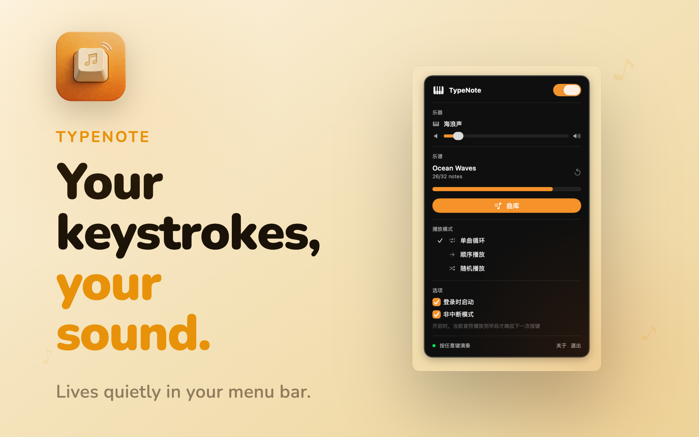
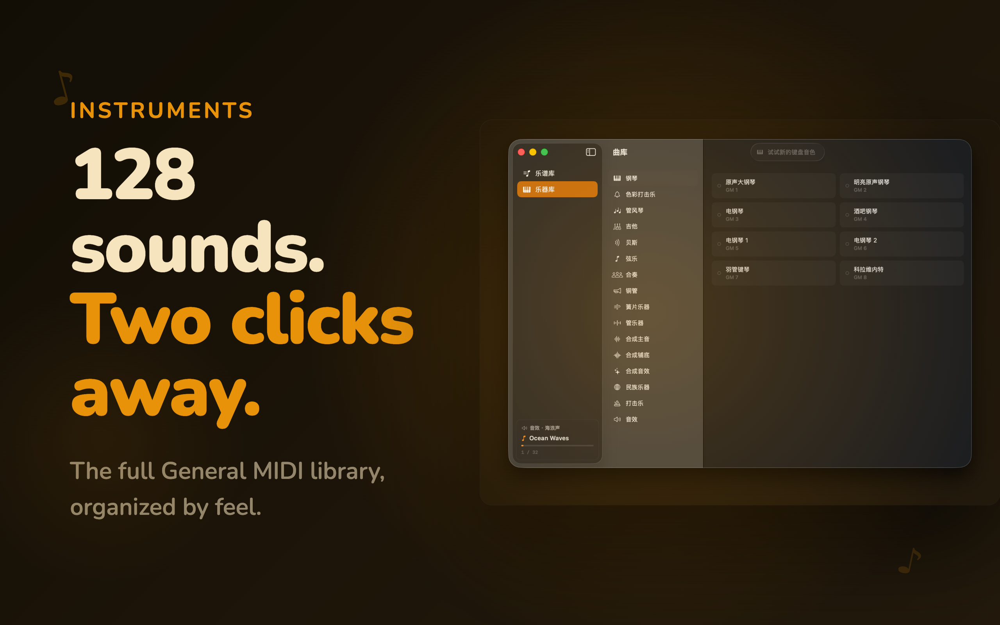
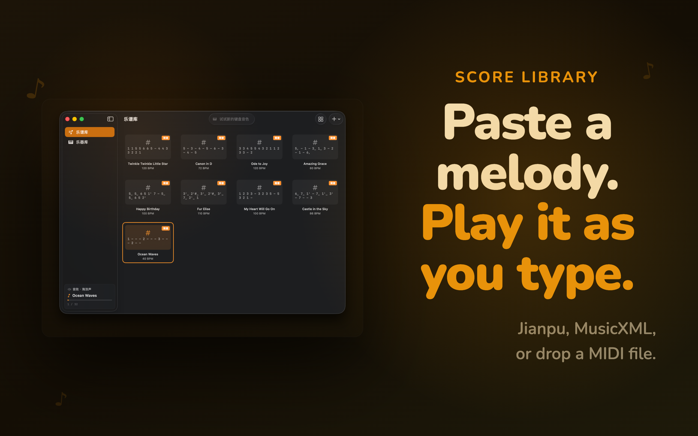

# TypeNote — Keyboard Sounds

> Your keyboard still types. It just sounds different now.

TypeNote is a native macOS menu bar app that turns every keystroke into a musical note. Choose from 128 General MIDI timbres, load your own melody, and keep working — your keyboard just sounds better.

**[Download for macOS →](https://github.com/huihuisang/TypeNote/releases/latest)**

---

## Screenshots

| Menu Bar                     | Instrument Library                    | Score Library                    |
| ---------------------------- | ------------------------------------- | -------------------------------- |
|  |  |  |

---

## Features

- **128 Timbres** — Full General MIDI library organized by mood. Switch from acoustic piano to steel drums in two clicks
- **Bring Your Own SoundFont** — Drop in any `.sf2` file (FluidR3, MuseScore General, Timbres of Heaven…) to expand beyond the bundled library. See [Free SoundFont Resources](docs/free-soundfonts.md)
- **Bring Your Own Melody** — Paste numbered notation (Jianpu), import MusicXML, or drop a MIDI file. Your keystrokes play the notes in sequence
- **Menu Bar Resident** — No windows to manage. Open it to change the sound, close it, keep working
- **Low Latency** — AVAudioEngine + 256-frame buffer, key-to-sound < 15 ms
- **Play Modes** — Sequential, single repeat, or shuffle through your melody library
- **Auto Update** — Sparkle-powered in-app updates

---

## Requirements

- macOS 14.0 (Sonoma) or later
- ~35 MB disk space

---

## Build from Source

### Prerequisites

- Xcode 15.0+
- Swift 5.9+

### 1. Clone

```bash
git clone https://github.com/huihuisang/TypeNote.git
cd TypeNote
```

### 2. Configure signing

```bash
cp LocalConfig.xcconfig.template LocalConfig.xcconfig
# Edit LocalConfig.xcconfig and set your DEVELOPMENT_TEAM
```

### 3. Download SoundFont

The bundled SoundFont (`GeneralUser GS.sf2`, ~31 MB) is included in the repo under `TypeNote/Resources/`. If it's missing, download it from [GeneralUser GS](https://github.com/mrbumpy409/GeneralUser-GS) and place it there.

### 4. Open and run

```bash
open TypeNote.xcodeproj
```

Press `Cmd+R` in Xcode.

---

## Numbered Notation (Jianpu) Syntax

```
1–7   do re mi fa sol la ti
0     rest
'     octave up (suffix)
,     octave down (suffix)
_     halve duration (suffix)
-     extend one beat
#     sharp (prefix)
b     flat (prefix)

Example — Twinkle Twinkle:
1 1 5 5 6 6 5 - 4 4 3 3 2 2 1 -
```

---

## Project Structure

```
TypeNote/
├── App/           # Entry point & app state (@Observable)
├── Audio/         # AVAudioEngine + SoundFont playback
├── Input/         # Global keystroke monitoring (CGEventTap)
├── Models/        # Score library and data models
├── Parser/        # Jianpu, MusicXML, and MIDI file parsers
├── Views/         # SwiftUI interface
└── Resources/     # SoundFont file
```

---

## Tech Stack

| Layer        | Technology                                |
| ------------ | ----------------------------------------- |
| UI           | SwiftUI + @Observable                     |
| Audio        | AVAudioEngine + AVAudioUnitSampler        |
| Input        | CGEventTap (global), NSEvent (local)      |
| Parsers      | XMLParser (MusicXML), AudioToolbox (MIDI) |
| Updates      | Sparkle 2                                 |
| Dependencies | Zero third-party runtime deps             |

---

## Docs

- [Product Requirements (PRD)](docs/PRD.md)
- [Roadmap](docs/ROADMAP.md)
- [App Store Metadata](docs/AppStore-Metadata.md)
- [Free SoundFont Resources](docs/free-soundfonts.md)

---

## Contributing

Pull requests are welcome. For major changes, please open an issue first to discuss what you'd like to change.

---

## Credits

- Audio powered by [GeneralUser GS SoundFont](https://github.com/mrbumpy409/GeneralUser-GS) by S. Christian Collins — free for all uses
- Auto-update powered by [Sparkle](https://sparkle-project.org)

---

## License

MIT License — see [LICENSE](LICENSE) for details.
